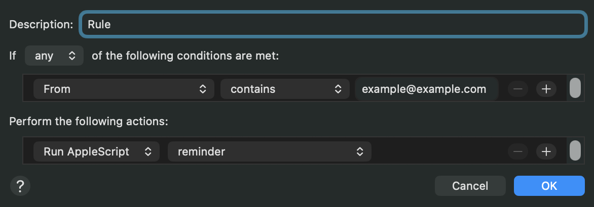

# mail-reminder-automation

Automated AppleScript Mail rule for statement email reminders that extracts billing information and creates reminders in macOS Reminders app.

## Features

- Extracts bank names from sender email domains
- Parses statement balance, due date, and minimum payment from email bodies
- Universal keyword-based parsing works with multiple bank formats

## Installation

### 1. Compile the Script

Run this command in Terminal from the project directory:

```bash
osacompile -o reminder.scpt reminder.applescript
```

### 2. Create Mail Rule



1. Open **Mail** app
2. Go to **Mail > Preferences > Rules**
3. Click **Add Rule**
4. Configure the rule with your desired conditions and select the compiled `reminder.scpt` script as the action
5. Click **OK** to save the rule

## Important Limitations
Due to the nature of AppleScript Mail rules, they only execute when the Mail application is actively running in the background to process incoming messages. Once Mail starts running, it collects messages that arrived while it was closed and triggers the rule for each matching message.

## Configuration

These properties in the script can be configured:

```applescript
-- Keywords to search for in email body
property keyword_balance : {"statement balance"}
property keyword_due : {"due date", "payment due date"}  
property keyword_minpayment : {"minimum payment", "minimum payment due"}

-- Reminder settings
property defaultListName : "Finance"            -- Reminders list name
property reminderPrefix : "Bill Payment Due"    -- Prefix for reminder titles
property defaultPriority : 1                    -- Priority for created reminders
property defaultFlagged : true                  -- Whether to flag created reminders
```

### Debugging

- Open **Console app** and search for "Mail rule error"
- Test with different statement emails to verify keyword matching
- Check that the Finance list exists in Reminders app

## Security

This script requires access to:
- Mail app (to read emails)
- Reminders app (to create reminders)
- Shell commands (for text processing)

Grant these permissions when prompted by macOS.
